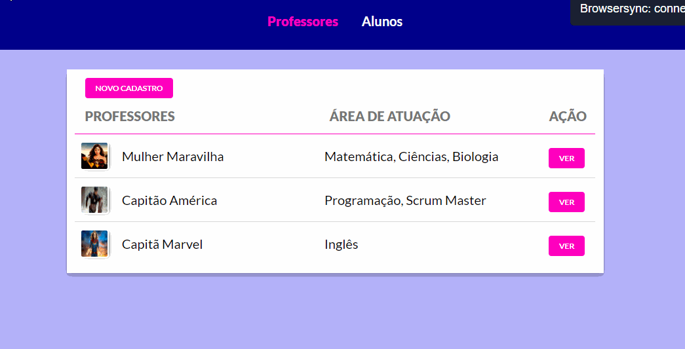

<h1 align="center">
    
</h1>

<h2 align="center">Manager (Responsivo) </h2>

    <strong>Ferramentas:</strong> 
    HTML, CSS, JavaScript, Node.js, Browser Sync, Method Override, Npm run all, PostgreSQL, Postbird, SQL

 
